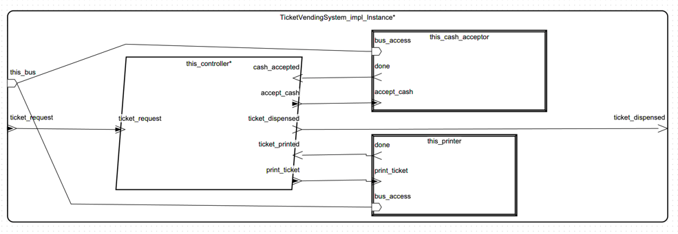
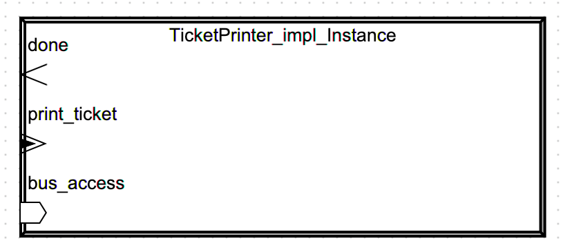
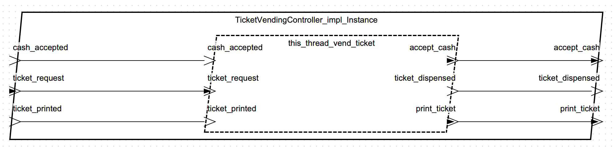
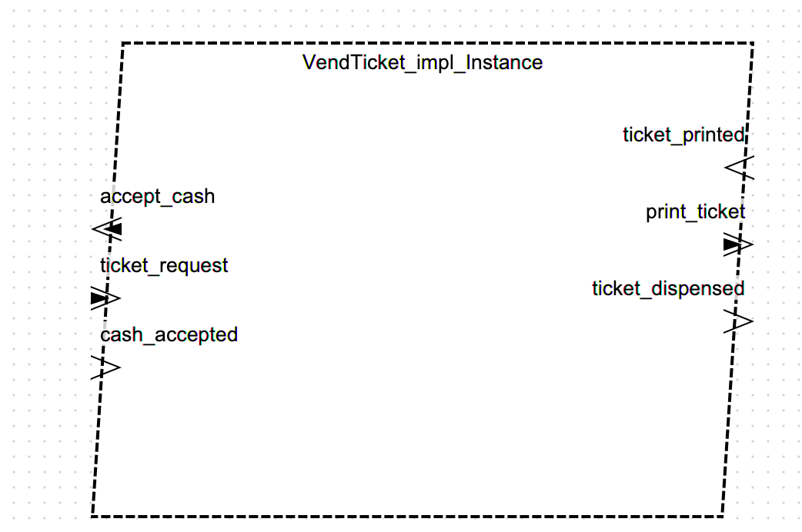

Sprawozdanie z projektu AADL: Automat Biletowy

1. Tytuł modelu
   Model architektury systemu automatu biletowego w języku AADL

2. Dane studenta
   Imię i nazwisko: Bartłomiej Kozak
   E-mail: bkozak@student.agh.edu.pl

3. Opis modelowanego systemu
   3.1 Opis ogólny
   Model przedstawia architekturę systemu automatu biletowego zrealizowaną w języku AADL.
   System umożliwia zakup biletu przez użytkownika, obsługę płatności gotówką, kontrolę stanu biletów i gotówki oraz
   komunikację z użytkownikiem przez ekran i przyciski. Model uwzględnia zarówno komponenty sprzętowe (sensory,
   urządzenia wejścia/wyjścia, magistralę, procesor, pamięć), jak i logikę sterującą (procesy, wątki).

   3.2 Opis dla użytkownika
   Użytkownik może wybrać rodzaj biletu za pomocą przycisków, dokonać płatności gotówką, a następnie odebrać wydrukowany
   bilet. Ekran informuje o stanie transakcji oraz ewentualnych problemach (np. brak biletów lub gotówki).

4. Spis komponentów AADL z komentarzem

   | Komponent                  | Typ       | Opis                                                              |
            |----------------------------|-----------|-------------------------------------------------------------------|
   | TicketVendingMachineSystem | system    | Główny system automatu biletowego                                 |
   | TicketStockSensor          | device    | Sensor poziomu biletów                                            |
   | CashLevelSensor            | device    | Sensor poziomu gotówki                                            |
   | Buttons                    | device    | Panel przycisków do wyboru biletu                                 |
   | Screen                     | device    | Ekran wyświetlający komunikaty dla użytkownika                    |
   | TicketVendingSystem        | system    | Podsystem obsługujący logikę wydawania biletów                    |
   | Controller                 | process   | Główny proces sterujący interakcją użytkownika i obsługą sensorów |
   | ReadLevels                 | thread    | Wątek odczytujący poziomy biletów i gotówki                       |
   | ReadButtons                | thread    | Wątek obsługujący przyciski i zgłaszający żądania zakupu          |
   | SerialBus                  | bus       | Magistrala komunikacyjna                                          |
   | MainProcessor              | processor | Procesor główny systemu                                           |
   | Ram                        | memory    | Pamięć RAM                                                        |

   Każdy komponent posiada precyzyjnie zdefiniowane porty wejścia/wyjścia, a komunikacja między nimi jest realizowana
   przez porty danych i zdarzeń. System korzysta z jednej magistrali komunikacyjnej i centralnego procesora.

5. Modele
    - TicketVendingSystem
      
    - TicketPrinter
      
    - TicketVendingController
      
    - VendTicket
      

6. Analizy modelu i wyniki

   Check Binding Constraints - OK

[//]: # (TODO)
