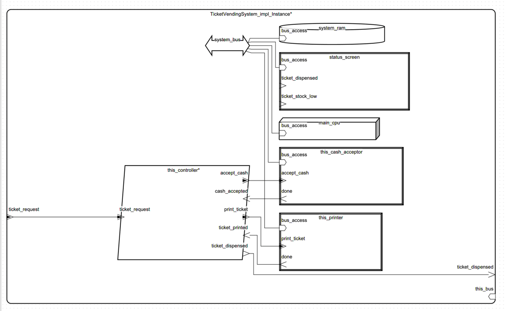

Sprawozdanie z projektu AADL: Automat Biletowy

1. Tytuł modelu
   Model architektury systemu automatu biletowego w języku AADL

2. Dane studenta
   Imię i nazwisko: Bartłomiej Kozak
   E-mail: bkozak@student.agh.edu.pl

3. Opis modelowanego systemu
   3.1 Opis ogólny
   Model przedstawia architekturę systemu automatu biletowego zrealizowaną w języku AADL.
   System umożliwia zakup biletu przez użytkownika, obsługę płatności gotówką, kontrolę stanu biletów i gotówki oraz
   komunikację z użytkownikiem przez ekran i przyciski. Model uwzględnia zarówno komponenty sprzętowe (sensory,
   urządzenia wejścia/wyjścia, magistralę, procesor, pamięć), jak i logikę sterującą (procesy, wątki).

   3.2 Opis dla użytkownika
   Użytkownik może wybrać rodzaj biletu za pomocą przycisków, dokonać płatności gotówką, a następnie odebrać wydrukowany
   bilet. Ekran informuje o stanie transakcji oraz ewentualnych problemach (np. brak biletów lub gotówki).

4. Spis komponentów AADL z komentarzem

   | Komponent                  | Typ       | Opis                                                              |
   |----------------------------|-----------|-------------------------------------------------------------------|
   | TicketVendingMachineSystem | system    | Główny system automatu biletowego                                 |
   | TicketStockSensor          | device    | Sensor poziomu biletów                                            |
   | CashLevelSensor            | device    | Sensor poziomu gotówki                                            |
   | Buttons                    | device    | Panel przycisków do wyboru biletu                                 |
   | Screen                     | device    | Ekran wyświetlający komunikaty dla użytkownika                    |
   | TicketVendingSystem        | system    | Podsystem obsługujący logikę wydawania biletów                    |
   | Controller                 | process   | Główny proces sterujący interakcją użytkownika i obsługą sensorów |
   | ReadLevels                 | thread    | Wątek odczytujący poziomy biletów i gotówki                       |
   | ReadButtons                | thread    | Wątek obsługujący przyciski i zgłaszający żądania zakupu          |
   | SerialBus                  | bus       | Magistrala komunikacyjna                                          |
   | MainProcessor              | processor | Procesor główny systemu                                           |
   | Ram                        | memory    | Pamięć RAM                                                        |

   Każdy komponent posiada precyzyjnie zdefiniowane porty wejścia/wyjścia, a komunikacja między nimi jest realizowana
   przez porty danych i zdarzeń. System korzysta z jednej magistrali komunikacyjnej i centralnego procesora.

5. Modele
    - TicketVendingSystem
      
    - TicketPrinter
      
    - TicketVendingController
      
    - VendTicket
      
    - Controller
      

6. Analizy modelu i wyniki

   Do analizy modelu AADL wykorzystano środowisko OSATE, które oferuje szereg narzędzi wspierających weryfikację
   poprawności oraz ocenę właściwości systemu. Wśród dostępnych metod analizy znajdują się m.in.:

    - [] Sprawdzenie poprawności modelu (Check Model):
      Narzędzie pozwala wykryć błędy składniowe oraz niespójności w definicji komponentów i połączeń.

    - [] Generowanie modelu instancyjnego (Instance Model Generation):
      Pozwala na wygenerowanie instancji systemu na podstawie modelu deklaratywnego, co umożliwia dalsze analizy.

    - [] Analiza połączeń (Connection Analysis):
      Umożliwia sprawdzenie poprawności połączeń portów oraz zgodności kierunków komunikacji.

    - [] Analiza zasobów (Resource Budget Analysis):
      Pozwala ocenić zużycie zasobów sprzętowych, takich jak pamięć czy moc obliczeniowa procesora.

    - [] Analiza czasowa (Timing Analysis):
      Umożliwia ocenę, czy zadeklarowane czasy wykonywania, okresy i deadline’y są spełnione przez wątki i procesy.

   Wstępnie przeprowadzono podstawowe analizy modelu, takie jak sprawdzenie poprawności składniowej oraz weryfikacja
   połączeń portów. Analizy te nie wykazały poważniejszych problemów, jednak ze względu na trwające prace nad modelem
   oraz jego rozbudowę, część wyników może być niepełna lub orientacyjna.
   W przyszłości przewidziane jest rozszerzenie analiz o szczegółowe sprawdzenie wymagań czasowych oraz budżetu zasobów.
